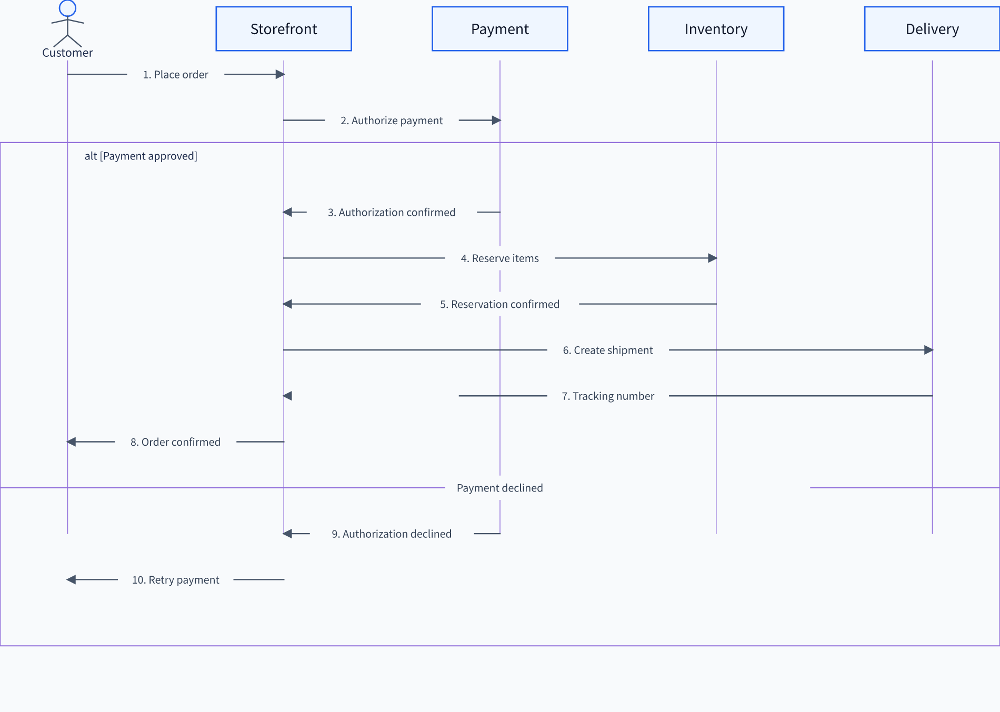
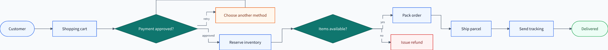

<div align="right">
  <strong>English</strong> · <a href="./README.ja.md">日本語</a>
</div>

# diagram-pptx

**Mermaid in. Editable PowerPoint shapes out.**

[](https://www.python.org/)
[](LICENSE)
[](#project-status)
[](#why-native-pptx-still-matters)

`diagram-pptx` is a Python-native diagram object model and compiler. It parses
Mermaid, lets Python inspect and modify the resulting typed model, and renders
the diagram as editable PowerPoint AutoShapes, connectors, text, and groups.
The same object can also be saved as SVG, PNG, or JPEG.

<p align="center">
  
</p>

The example above is fictional public sample data. The sequence diagram is
generated from Mermaid and remains addressable by semantic ID in Python.

## Fastest start

```bash
pip install diagram-pptx
```

```python
from pptx import Presentation
from diagram_pptx import render_mermaid

source = """
flowchart LR
    request[Request] --> review{Approved?}
    review -->|yes| publish[Publish]
    review -->|no| request
"""

prs = Presentation()
slide = prs.slides.add_slide(prs.slide_layouts[6])

render_mermaid(source, slide=slide, position="full")
prs.save("diagram.pptx")
```

That is enough to create one movable, resizable, ungroupable PowerPoint
diagram. Native rendering does not require PowerPoint, Node.js, Chromium,
Docker, or LibreOffice.

## Why it is different

| Capability | What it provides |
| --- | --- |
| Editable PowerPoint | Native shapes and connectors instead of a flattened screenshot |
| Typed Python models | Separate Flow, Sequence, Class, ER, and State object models |
| ORM-like editing | Direct access such as `model.nodes["db"]` and semantic `select()` |
| Mermaid frontend | Source locations, diagnostics, strict parsing, and canonical serialization |
| Two geometry backends | Deterministic Pure Python Native or Mermaid CLI Official |
| Reusable styling | Themes, roles, class/ID overrides, RGBA, and continuous color maps |
| Flexible placement | Inch bounds, named slide regions, or normalized `0..1` coordinates |
| Image output | Dependency-free SVG and optional high-resolution PNG/JPEG |
| Agent-ready API | Typed signatures and JSON-safe result objects for MCP or other tools |

```text
Mermaid / JSON / future frontend
                ↓
        typed semantic model
                ↓
              layout
                ↓
          DrawingScene
                ↓
         style resolution
         ↙      ↓      ↘
 editable    SVG    PNG/JPEG
   PPTX
```

Mermaid is the primary declarative frontend, not the internal representation.
Renderers consume `DrawingScene`; they do not need to understand Mermaid.

## Parse, edit, and compile

```python
from pptx import Presentation
from diagram_pptx import compile_diagram, parse_mermaid

source = """
flowchart LR
    api([API]) --> db[(Database)]
"""

diagram = parse_mermaid(source)
diagram.model.nodes["db"].label = "Primary DB"
diagram.model.nodes["db"].classes.add("storage")

prs = Presentation()
slide = prs.slides.add_slide(prs.slide_layouts[6])

result = compile_diagram(
    diagram,
    slide=slide,
    bounds=(1, 1, 11, 5.5),
    style="official",
    group=True,
)

# Native python-pptx objects remain available after grouping.
result.element_shapes["db"].text = "Primary database"
result.group_shape.width = int(result.group_shape.width * 1.1)
prs.save("database-flow.pptx")
```

All ID-bearing semantic entities are mutable dataclasses stored in
insertion-ordered dictionaries. This keeps the Python API small and
predictable for application code and tool calls.

## Save SVG, PNG, and JPEG

Install raster output support when needed:

```bash
pip install "diagram-pptx[image]"
```

Or install every optional runtime feature:

```bash
pip install "diagram-pptx[all]"
```

Then save the same parsed object in a Matplotlib-like style:

```python
diagram.save("diagram.svg")
diagram.save("diagram.png", dpi=600, background="transparent")
diagram.save("diagram.jpg", dpi=300, background="#FFFFFF", quality=92)

svg_text = diagram.to_svg()
png_bytes = diagram.to_png(dpi=300)
jpeg_bytes = diagram.to_jpeg(dpi=300)
```

- SVG is vector output and needs no additional package.
- PNG supports transparent backgrounds.
- JPEG flattens transparency onto the requested background.
- `width_px` and `height_px` provide exact raster dimensions.
- A pixel limit prevents accidental creation of extremely large images.

## Flowcharts

<p align="center">
  
</p>

The public sample demonstrates decisions, cycles, labeled branches, terminal
shapes, and ID-specific styling without exposing any project-specific process.

## Backends and Node.js

| Backend | Runtime | Behavior |
| --- | --- | --- |
| `native` (default) | Python only | Deterministic layout for all five typed diagram families |
| `official` | `mmdc` + Chromium | Mermaid computes geometry; the SVG geometry is imported as editable shapes |
| `auto` | Automatic | Uses Official when `mmdc` is available, otherwise Native |

`pip install diagram-pptx` does **not** install Node.js. Here, Node.js means the
JavaScript runtime—not a diagram node—and it is required only for Official
geometry.

```bash
npm install -g @mermaid-js/mermaid-cli@11.16.0
mmdc --version
diagram-pptx doctor
```

Selecting `backend="official"` without `mmdc` raises an error with installation
instructions. `backend="auto"` falls back to Native and records an
informational diagnostic. The Docker development image includes the pinned
Official runtime.

## Themes and color maps

The geometry backend and visual style are independent:

```python
render_mermaid(
    source,
    slide=slide,
    backend="native",
    style="official",
    colors={
        "name": "viridis",
        "primary": 0.82,
        "secondary": 0.18,
    },
)
```

Built-in continuous maps are `jet`, `viridis`, `plasma`, and `magma`.
`primary` controls ordinary fills; `secondary` is shorthand for decision
fills, outlines, connectors, and container lines. Individual channels such as
`fill`, `line`, `edge`, `text`, and `decision_fill` can be specified
separately.

When no explicit text color is provided, each filled node chooses light or
dark text using relative luminance and contrast.

Theme precedence with the default `source_style="merge"` is:

```text
renderer defaults
< theme role defaults
< Mermaid classDef / inline style
< theme class and ID overrides
< render-time element override
< final color-map replacement
```

Versioned JSON themes are supported; YAML is intentionally not required.

## Place diagrams on an existing slide

```python
render_mermaid(left_source, slide=slide, position="left")
render_mermaid(right_source, slide=slide, position="right")
```

For exact placement:

```python
render_mermaid(
    source,
    slide=slide,
    relative_bounds=(0.05, 0.10, 0.40, 0.80),
)
```

Placement accepts:

- `bounds=(left, top, width, height)` in inches;
- `position="full"|"left"|"right"|"top"|"bottom"`;
- normalized `relative_bounds=(x, y, width, height)` from the top-left.

## Mermaid support

| Family | Native semantic coverage in `0.1.0a1` |
| --- | --- |
| Flowchart | directions, common shapes, labeled/chained edges, cycles, self-loops, nested subgraphs, `classDef`, `class`, `style`, `linkStyle` |
| Sequence | participants, actors, messages, notes, activations, autonumber, `loop`, `alt`, `else`, `opt`, `par`, `critical`, `break` |
| Class | attributes, methods, stereotypes, namespaces, typed relationships, labels, notes, direction |
| ER | entity attributes, PK/FK/UK, cardinalities, relationship labels, direction |
| State | start/end, simple/composite states, transitions, notes, direction, choice/fork/join |

Unsupported Mermaid statements are never silently dropped. They remain in
`MermaidDocument.raw_statements` with line/column diagnostics. An unchanged
partial document can be rendered by Official. Mutating a partial semantic
model raises `PartialModelMutationError` before source information can be
lost. `strict=True` rejects unsupported syntax during parsing.

## CLI

```bash
diagram-pptx render input.mmd output.pptx \
  --backend native --style official --position left

diagram-pptx inspect input.mmd --json
diagram-pptx doctor
```

`inspect` reports the diagram family, modeled rate, diagnostics, preserved
statements, and required backend. `doctor` checks Python, `python-pptx`,
Mermaid CLI, SVG/PNG/JPEG output, LibreOffice, and Poppler.

## Tool and agent integrations

The core package is provider-neutral. It does not embed vendor-specific
function schemas. MCP servers, Codex plugins, and other adapters should call
the same typed Python API and return `CompileResult.to_dict()` or
`ExportResult.to_dict()`.

See [MCP and Codex integration](docs/mcp-integration.md) for a FastMCP adapter,
plugin manifest, and skill example.

## Docker development

```bash
docker compose run --build --rm test
docker compose run --build --rm official-test
docker compose run --build --rm example
```

The fixed Docker environment contains Node.js, Mermaid CLI 11.16.0, Chromium,
LibreOffice, Poppler, and Noto CJK fonts. Docker is a development and
integration-test environment; it is not required for the normal Python API.

## Why native PPTX still matters

SVG and PNG are useful for previews and publishing, but they do not replace
editable PowerPoint objects. Native output lets callers move, resize, ungroup,
restyle, or address individual semantic elements after compilation. The
package is not a general SVG-input-to-PowerPoint converter.

## Project status

`0.1.0a1` is an alpha API. Native tests run on Python 3.10–3.13. Official
integration and PPTX-to-PDF-to-PNG visual checks run in the pinned Docker
environment. OOXML and LibreOffice are the automated compatibility baseline;
pixel-perfect identity with Microsoft PowerPoint is not guaranteed.

## License

[MIT](LICENSE)

See [architecture.md](docs/architecture.md) for extension contracts and
[CONTRIBUTING.md](CONTRIBUTING.md) for development checks.
