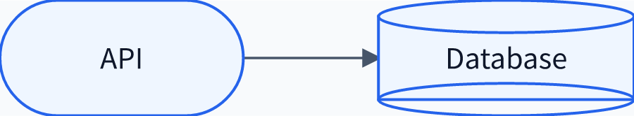

<div align="right">
  <a href="./user-guide.md">English</a> · <strong>日本語</strong>
</div>

# diagram-pptx 利用ガイド

このガイドでは、プロジェクトREADMEでは簡潔にしている実用上の詳細を説明します。

## 目次

- [Pythonオブジェクトモデル](#pythonオブジェクトモデル)
- [PowerPoint描画](#powerpoint描画)
- [画像出力](#画像出力)
- [配置](#配置)
- [文字サイズと単位](#文字サイズと単位)
- [BackendとNode.js](#backendとnodejs)
- [テーマとカラーマップ](#テーマとカラーマップ)
- [Mermaid対応範囲](#mermaid対応範囲)
- [CLI](#cli)
- [開発環境](#開発環境)

## Pythonオブジェクトモデル

`parse_mermaid()`は、元ソース、型付き可変モデル、診断、保持されたstatement、
初期モデルのfingerprintを含む`MermaidDocument`を返します。

```python
from diagram_pptx import compile_diagram, parse_mermaid
from pptx import Presentation

source = """
flowchart LR
    api([API]) --> db[(Database)]
"""
```

<p align="center">
  
</p>

上の画像は、このMermaidソースから直接生成したNative出力です。続けてモデルを
変更し、既存スライドへコンパイルできます。

```python
document = parse_mermaid(source)
document.model.nodes["db"].label = "Primary DB"
document.model.nodes["db"].classes.add("storage")

prs = Presentation()
slide = prs.slides.add_slide(prs.slide_layouts[6])

result = compile_diagram(
    document,
    slide=slide,
    bounds=(1, 1, 11, 5.5),
    style="official",
    group=True,
)

result.element_shapes["db"].text = "Primary database"
result.group_shape.width = int(result.group_shape.width * 1.1)
prs.save("database-flow.pptx")
```

semantic IDを持つ要素は可変dataclassで、挿入順を保つ辞書に格納されます。
モデルとテーマは`to_dict()`・`from_dict()`に対応し、versioned JSON Schemaも
パッケージに同梱されています。

## PowerPoint描画

`render_mermaid()`はparseとcompileをまとめた簡便APIです。Pythonでsemantic
modelを確認・変更してから描画する場合は、解析済みdocumentを
`compile_diagram()`へ渡します。

既定では、編集可能なネイティブ図形、コネクター、ラベル、注釈を1つの
PowerPoint GroupShapeにまとめます。個々の図形をスライド直下へ残す場合は
`group=False`を指定します。

`CompileResult`から次の情報を取得できます。

- `backend_used`と`mermaid_version`
- `diagnostics`
- `group_shape`
- semantic IDをキーにした`element_shapes`
- `top_level_shapes`

`.pptx`の生成にPowerPoint本体は必要ありません。core runtimeでは
`python-pptx`を使用します。

## 画像出力

SVG出力に追加runtime依存はありません。PNG・JPEGには`image` extraを使います。

```bash
pip install "diagram-pptx[image]"
```

任意のPython機能をすべて導入する場合:

```bash
pip install "diagram-pptx[all]"
```

解析済みdocumentはMatplotlibに近い保存APIを提供します。

```python
document.save("diagram.svg")
document.save("diagram.png", dpi=600, background="transparent")
document.save("diagram.jpg", dpi=300, background="#FFFFFF", quality=92)

svg_text = document.to_svg()
png_bytes = document.to_png(dpi=300)
jpeg_bytes = document.to_jpeg(dpi=300)
```

PNGは透過背景に対応します。JPEGは透過部分を指定背景へ合成します。
`width_px`・`height_px`で正確なpixel寸法を指定でき、最大pixel数の制限により
意図しない巨大画像の生成を防ぎます。

画像出力では、コネクター／メッセージラベルの背景は既定で白です。白以外の
キャンバスでは同じ色を指定できます。

```python
canvas = "#0F172A"
document.save(
    "diagram.png",
    background=canvas,
    label_background=canvas,
)
```

編集可能なPowerPointでも同じ引数を使用できます。

```python
render_mermaid(
    source,
    slide=slide,
    label_background="#F3F0E8",
)
```

ラベル背景をなくす場合は`label_background="transparent"`を指定します。
テーマではrole、class、IDごとに`label_fill`を指定できます。個別要素のoverrideと
カラーマップの`label_fill`は、この全体指定より優先されます。不透明なRGB/RGBA
背景では、個別overrideやカラーマップの`text`がない限り、文字色を明色または
暗色へ自動調整します。

## 配置

領域名で左右に配置できます。

```python
render_mermaid(left_source, slide=slide, position="left")
render_mermaid(right_source, slide=slide, position="right")
```

スライド左上を原点にした相対座標も使用できます。

```python
render_mermaid(
    source,
    slide=slide,
    relative_bounds=(0.05, 0.10, 0.40, 0.80),
)
```

配置方法は次の3種類です。

- `bounds=(left, top, width, height)`：inch指定
- `position="full"|"left"|"right"|"top"|"bottom"`：領域preset
- `relative_bounds=(x, y, width, height)`：`0..1`の相対座標

指定したboundsが図の利用可能領域になります。layoutが内部aspect ratioを計算し、
rendererがscene全体をその領域へ収めます。

## 文字サイズと単位

文字サイズの既定単位はptです。個々の要素では単位も明示できます。

```python
from diagram_pptx import FontSize

document.model.nodes["api"].style.font_size = 18  # 18 pt
document.model.nodes["db"].style.font_size = "24px"  # 96 dpiで18 pt
document.model.nodes["queue"].style.font_size = "2.5%sh"  # スライド高の2.5%
```

型付き指定は`FontSize.pt(18)`、`FontSize.px(24)`、
`FontSize.slide_height(0.025)`です。スライド比率はdiagramのboundsではなく
ページ全体の高さを基準にするため、同じスライド内で左右に配置した図でも文字の
大きさが揃います。

1つの設定をデッキ全体で使う場合は、再利用可能なcompiler instanceを作ります。

```python
from diagram_pptx import (
    DiagramCompiler,
    DiagramSettings,
    TypographySettings,
)

compiler = DiagramCompiler(
    DiagramSettings(
        typography=TypographySettings(
            japanese_font_family="Yu Gothic",
            node="18pt",
            edge="12pt",
            group="14pt",
            fit="fit",
        )
    )
)

compiler.render_mermaid(source, slide=slide, position="left")
compiler.render_mermaid(other_source, slide=slide, position="right")
```

既定は`fit="fit"`です。単位付きの明示サイズをPowerPoint上の希望サイズとして
扱い、ファイルを開く前に図形の実寸へ合わせて縮小します。PowerPointのautofitも
最後の安全策として有効にします。`fit="none"`では、はみ出しても指定サイズを
維持します。自動文字には通常9pt、connector／messageには12ptの下限があり、
`min_font_size`と`edge_min_font_size`で変更できます。下限でも収まらない場合は、
ラベルの短縮・明示改行・bounds拡大・diagram分割のいずれかが必要です。

日本語を含む文字列の既定fontは`Yu Gothic`（游ゴシック）で、PowerPointの
East Asian typefaceにも明示します。compiler単位で
`japanese_font_family="BIZ UDPGothic"`のように変更できます。
全言語を同じfontにする場合は`font_family`を指定します。

1つのdiagram内で意図的に文字サイズを変えることもできます。

```python
result = compiler.render_mermaid(
    source,
    slide=slide,
    style_overrides={
        "primary_decision": {"font_size": "24pt"},
        "supporting_note": {"font_size": "12pt"},
    },
)
```

fit処理はこの相対的な大小を維持し、収まらない個別図形だけを縮小します。

文字設定の優先順位は通常のstyle階層と同じです。

```text
package defaults
< DiagramSettings
< theme role
< Mermaid/source element style
< theme class and ID
< compile時style_overrides
```

OS環境変数やmodule globalではなくinstance設定なので、同じPython process内でも
デッキごとに異なるpolicyを安全に使用できます。

## BackendとNode.js

geometryと視覚styleは別々のoptionです。

| Backend | Runtime | 動作 |
| --- | --- | --- |
| `native`（既定） | Pythonのみ | 5つの型付き図種を決定論的に配置 |
| `official` | `mmdc`とChromium | MermaidがSVG geometryを計算し、編集可能な図形へ変換 |
| `auto` | 自動 | `mmdc`があればOfficial、なければNative |

`pip install diagram-pptx`はNode.jsをインストールしません。ここでいうNode.jsは
図のnodeではなくJavaScript runtimeで、Official geometryを使う場合だけ必要です。

```bash
npm install -g @mermaid-js/mermaid-cli@11.16.0
mmdc --version
diagram-pptx doctor
```

`mmdc`なしで`backend="official"`を選ぶと、導入手順を含むエラーになります。
`backend="auto"`はNativeへ切り替え、情報diagnosticを記録します。Officialで
サポートするMermaid CLIは11.16.xで、strict modeでは異なるversionを拒否します。

部分的にのみモデル化されたdocumentでも、モデルを変更していなければOfficialで
元のMermaidソースを保持して描画できます。partial semantic modelを変更すると、
情報欠落を防ぐため`PartialModelMutationError`になります。

## テーマとカラーマップ

Native geometryへOfficialに近い視覚styleを適用できます。

```python
render_mermaid(
    source,
    slide=slide,
    backend="native",
    style="official",
    colors={
        "name": "viridis",
        "primary": 0.82,
        "secondary": 0.18,
    },
)
```

組み込みの連続カラーマップは`jet`、`viridis`、`plasma`、`magma`です。
`primary`は通常nodeのfillを制御します。`secondary`はdecision fill、outline、
connector、container lineの短縮指定です。`fill`、`line`、`edge`、`text`、
`decision_fill`などを個別指定することもできます。

文字色を指定しない場合、各nodeは相対輝度とcontrastに基づき、明色または暗色を
自動選択します。

既定の`source_style="merge"`では、次の順でstyleを解決します。

```text
renderer defaults
< theme role defaults
< Mermaid classDef / inline style
< theme class and ID overrides
< render-time element override
< final color-map replacement
```

`preserve`はMermaidの明示styleを優先します。`replace`はsemantic roleとclassを
保持しながら、Mermaidの視覚propertyを無視します。versioned JSON themeに対応し、
YAML依存は追加していません。

## Mermaid対応範囲

Mermaid 11.16の公開30図種と、同梱された実験的Railroadの全31ファミリーを
認識し、ソースを欠落なく保持します。固定版Official integration suiteでは
全ファミリーのfixtureを編集可能なPowerPoint図形へ変換します。
Flowchart、Sequence、Class、ER、StateはTypedモデルとNative layoutにも対応します。

図種一覧と5つのTypedモデル内のstatement単位の差分は
[Mermaid互換性matrix](mermaid-compatibility.ja.md)を参照してください。

## CLI

```bash
diagram-pptx render input.mmd output.pptx \
  --backend native --style official --position left

diagram-pptx inspect input.mmd --json
diagram-pptx support --json
diagram-pptx doctor
```

`inspect`は図種、モデル化率、diagnostic、保持statement、必要backendを表示します。
`doctor`はPython、`python-pptx`、Mermaid CLI、画像出力、LibreOffice、Popplerを
確認します。

## 開発環境

Dockerは再現可能な開発・integration testに使用します。通常のPython API利用には
必要ありません。

```bash
docker compose run --build --rm test
docker compose run --build --rm official-test
docker compose run --build --rm example
```

固定imageにはNode.js、Mermaid CLI 11.16.0、Chromium、LibreOffice、Poppler、
Noto CJK fontが含まれます。自動互換性確認はOOXML検査とLibreOffice描画を基準とし、
Microsoft PowerPointとのpixel-perfectな同一性は保証しません。

内部構造や新しいfrontend／rendererについては
[architecture.md](architecture.md)、provider-neutralなtool連携については
[mcp-integration.md](mcp-integration.md)を参照してください。
